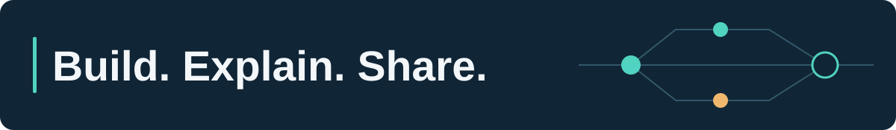

# Hello there, I’m Yoha

**I build AI systems and help developers understand the engineering behind them.**

I'm a senior engineering leader, AI architect, founder of **[AgenticWorks](https://agenticworks.com/)**, and a **Google Cloud Next ’26 speaker**. My work spans retail, payments, and intelligent automation; my public projects and teaching focus on Google Cloud, Gemini, ADK, and agent evaluation.

[Learn](https://agenticworks.com/learn) · [Talk and team](https://yoha02.github.io/A4G_LandingPage/) · [Community contributions](community.md) · [LinkedIn](https://www.linkedin.com/in/yg2017/)

## Start here

| You want to… | Start with… |
|---|---|
| Understand neural networks from first principles | [NeuralNet Fundamentals](https://agenticworks.com/learn/neuralnet/first-neuron): a guided Python and NumPy track with notebook source. |
| Understand how ADK agents fit together | [My illustrated ADK guide](https://agenticworks.com/forum/google-adk-deep-dive): tools, orchestration, state, evaluation, and deployment. |
| Explore a team-built Cloud AI application | [AI-mmunity](https://github.com/Yoha02/agent4good): a community-health agent prototype using ADK, Gemini, BigQuery, and Cloud Run. |

## From a team project to Google Cloud Next ’26

I presented **[Silos to Synergy: Architecting Scalable Multi-Agent Systems](https://www.linkedin.com/feed/update/urn:li:activity:7459590446554435584/)** at the Developer Theater. Our **AI-mmunity** team won Google Cloud's Agentic AI Arena.

The talk explored data readiness, evaluating the whole agent system, and managing orchestration and permission boundaries.

[Project and team](https://yoha02.github.io/A4G_LandingPage/) · [Source code](https://github.com/Yoha02/agent4good) · [Technical recap and discussion](https://www.linkedin.com/feed/update/urn:li:activity:7459590446554435584/)

## Build and learn

| Resource | What it offers |
|---|---|
| [AI Trainings](https://github.com/Yoha02/AI_Trainings) | Three labs exploring Gemini, vector search, and RAG. |
| [CX Lab](https://github.com/Yoha02/CX_Lab) | Team experiments in evaluating and improving voice-agent policies. |
| [Neural Network Fundamentals](https://github.com/Yoha02/NeuralNet_Fundamentals) | Ten notebooks behind the AgenticWorks learning track. |

## Core technologies

- **Agents & models:** Gemini · Vertex AI · Google ADK ([labs](https://github.com/Yoha02/AI_Trainings), [guide](https://agenticworks.com/forum/google-adk-deep-dive)).
- **Cloud & data:** Cloud Run · BigQuery · Firebase ([AI-mmunity](https://github.com/Yoha02/agent4good)).
- **Research & teaching:** Python · NumPy · Jupyter ([notebooks](https://github.com/Yoha02/NeuralNet_Fundamentals)).

## Research in public

Through **[LLM Arena](https://llmarena.io/arena)**, I study how language models interact: cooperation, competition, persuasion, and adherence to their assigned goals. The project supports configurable experiments and judge-based evaluation. [Explore the research code →](https://github.com/Yoha02/LLM_Arena_UI)

## Writing from the work

- **[ADK as a software-engineering lifecycle](https://agenticworks.com/forum/google-adk-deep-dive)**: an illustrated guide with an order-operations example.
- **[Lessons from recent AI projects](https://www.linkedin.com/feed/update/urn:li:activity:7507891682894508032/)**: reflections on agent improvement, grounding, and interface design.

## Hackathons and community

I'm an active participant in Bay Area hackathons, with multiple team wins. I also enjoy hosting hackathons with companies and local developer communities. Building alongside other developers is one of my favorite ways to learn and share ideas.

Try a lesson, share where you got stuck, or suggest a clearer example. Questions and corrections are welcome in the relevant repository's issues or the [AgenticWorks forum](https://agenticworks.com/forum).

[Explore my teaching, talks, and public contributions →](community.md)

<strong>Research, education, and inventions</strong>

I hold an **M.S. in Computer Science from Georgia Tech** and an **M.S. in Applied Artificial Intelligence from the University of San Diego**. My research with Georgia Tech's Design & Intelligence Laboratory and AI-ALOE explores socially aware AI, learner engagement, and social presence in online classrooms.

I am a co-inventor on patents for real-time product interaction assistance: [US11106327B2](https://patents.google.com/patent/US11106327B2/en) and [CN112771472B](https://patents.google.com/patent/CN112771472B/zh).

